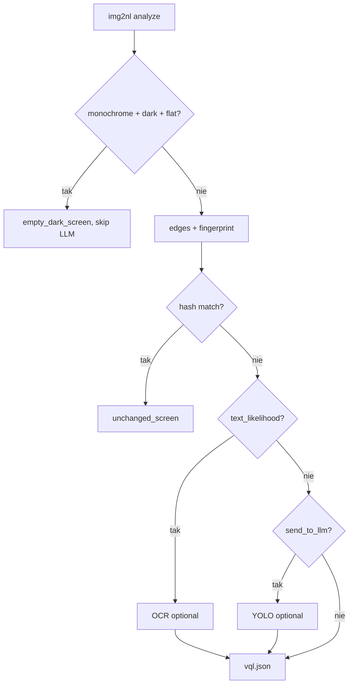

# Detection pipeline — warstwowy plan img2nl

Heurystyczny pipeline **image → natural language** bez vision LLM. Cięższe moduły uruchamiane warunkowo.

## Warstwa 0 — core (Pillow + NumPy)

Już zaimplementowane w `src/img2nl/features/`:

| Moduł | Plik | Czas | Opis |
|-------|------|------|------|
| Kolory | `colors.py` | ~1–5 ms | monochrom, dominujące kolory, jasność |
| Dynamika | `dynamics.py` | ~1 ms | kontrast, stddev luminancji |
| Szum | `noise.py` | ~5–10 ms | płaskość vs tekstura (Gaussian blur residual) |
| Obiekty | `objects.py` | ~5 ms | duże regiony na siatce 32×32 |
| Wzorce | `patterns.py` | ~5 ms | pasy/siatka (periodyczność wariancji) |

Wynik: opis typu „pusty/ciemny ekran”, „UI z blokami”, „płaska powierzchnia”.

## Warstwa 1 — OpenCV (opcjonalna)

Extra: `pip install img2nl[opencv]`

| Algorytm | Moduł | Po co |
|----------|-------|-------|
| Laplacian variance | `edges.py` | ostrość / blur |
| Canny edge density | `edges.py` | tekst/UI vs płaska tapeta |
| Shannon entropy | `edges.py` | złożoność sceny |

Trigger OCR (warstwa 3): `text_likelihood == true`.

## Warstwa 2 — podobieństwo ekranów

Extra: `pip install img2nl[similarity]`

| Algorytm | Moduł | Po co |
|----------|-------|-------|
| pHash / dHash / wHash | `fingerprint.py` | deduplikacja ramek, cache VQL |
| SSIM (opcjonalnie) | `scikit-image` | drugi etap po hash |

Fingerprint trzymaj w `.vql.json` / wyniku `analyze_image()` → query bez ponownej analizy.

## Warstwa 3 — moduły specjalistyczne (planowane)

Odpalane warunkowo:

| Moduł | Paczka | Trigger |
|-------|--------|---------|
| QR/barcode | `pyzbar` | wysoki kontrast + prostokątne regiony |
| OCR | `rapidocr-onnxruntime` lub `easyocr` | `text_likelihood` |
| Twarze | `mediapipe` / OpenCV Haar | regiony skóropodobne |

Extra: `pip install img2nl[scan]` / `[ocr]`.

## Warstwa 4 — semantyka (planowane, premium)

| Paczka | Kiedy |
|--------|-------|
| `ultralytics` | nazwy obiektów (person, laptop) gdy `llm_gate.send_to_llm` |
| CLIP (transformers) | zero-shot tagi |

Extra: `pip install img2nl[detect]`.

## Klasy sceny (`scene.py`)

Reguły bez ML — pole `features.scene.scene_class`:

| Warunek | `scene_class` |
|---------|---------------|
| monochrom + ciemny + płaski | `empty_dark_screen` |
| `text_likelihood` + regular pattern | `ui_with_text` |
| duże obiekty + wysoki kontrast | `ui_blocks` |
| wysoka gęstość krawędzi | `dense_ui_or_code` |
| fingerprint ≈ poprzedni (VQL) | `unchanged_screen` |
| domyślnie | `general` |

## Schema JSON (rozszerzenie `features`)

```json
{
  "colors": {},
  "dynamics": {},
  "noise": {},
  "objects": {},
  "patterns": {},
  "edges": {
    "available": true,
    "blur_score": 412.5,
    "edge_density": 0.031,
    "entropy": 4.2,
    "text_likelihood": false
  },
  "fingerprint": {
    "available": true,
    "phash": "a1b2c3d4e5f6g7h8",
    "dhash": "...",
    "whash": "..."
  },
  "scene": {
    "scene_class": "empty_dark_screen",
    "labels": ["monochrome_or_dark", "flat_blank_like"]
  },
  "special_hits": {},
  "semantic_hits": {}
}
```

## Profile instalacji

```bash
pip install -e ".[analyze]"                    # Pillow + NumPy (core)
pip install -e ".[analyze,opencv]"            # + edges
pip install -e ".[analyze,similarity]"        # + fingerprint
pip install -e ".[full]"                      # analyze + opencv + similarity (+ scan gdy dodane)
```

## Integracja VQL / img2vql



Przykład: ekran `#000000`, `object_count: 144` z siatki VQL → gałąź **C**, bez OCR/YOLO.

## Kolejność implementacji

1. [x] Dokumentacja (`docs/detection-pipeline.md`)
2. [x] `edges.py`, `fingerprint.py`, `scene.py`
3. [x] `analyze_image()` — lazy optional modules
4. [x] `describe.py`, `llm_gate.py` — scene_class
5. [ ] `pyzbar` / OCR (warstwa 3)
6. [ ] `ultralytics` (warstwa 4)
7. [ ] SSIM + nearest screen w VQL cache

## CLI

```bash
img2nl analyze photo.png --json
# edges + fingerprint gdy zainstalowane extras
```
