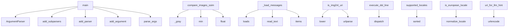

# System Architecture Analysis
<!-- generated in 0.00s -->

## Overview

- **Project**: /home/tom/github/wronai/img2nl
- **Primary Language**: python
- **Languages**: python: 38, toml: 4, shell: 3, json: 2, yaml: 1
- **Analysis Mode**: static
- **Total Functions**: 63
- **Total Classes**: 5
- **Modules**: 49
- **Entry Points**: 15

## Architecture by Module

### src.img2nl.i18n.offline
- **Functions**: 8
- **Classes**: 1
- **File**: `offline.py`

### packages.dsl2img2nl.src.dsl2img2nl.handlers
- **Functions**: 4
- **File**: `handlers.py`

### packages.uri2img2nl.src.uri2img2nl.uri
- **Functions**: 4
- **Classes**: 1
- **File**: `uri.py`

### src.img2nl.features.ocr_text
- **Functions**: 3
- **File**: `ocr_text.py`

### src.img2nl.features.semantic
- **Functions**: 3
- **File**: `semantic.py`

### src.img2nl.features.similarity
- **Functions**: 3
- **File**: `similarity.py`

### src.img2nl.features.barcodes
- **Functions**: 3
- **File**: `barcodes.py`

### src.img2nl.i18n.locales
- **Functions**: 3
- **File**: `locales.py`

### packages.dsl2img2nl.src.dsl2img2nl.bus
- **Functions**: 2
- **File**: `bus.py`

### src.img2nl.features.edges
- **Functions**: 2
- **File**: `edges.py`

### src.img2nl.features.colors
- **Functions**: 2
- **File**: `colors.py`

### src.img2nl.features.fingerprint
- **Functions**: 2
- **File**: `fingerprint.py`

### src.img2nl.features.objects
- **Functions**: 2
- **File**: `objects.py`

### packages.dsl2img2nl.src.dsl2img2nl.grammar
- **Functions**: 2
- **File**: `grammar.py`

### src.img2nl.describe
- **Functions**: 2
- **File**: `describe.py`

### packages.uri2img2nl.src.uri2img2nl.query
- **Functions**: 2
- **Classes**: 1
- **File**: `query.py`

### packages.dsl2img2nl.src.dsl2img2nl.cli
- **Functions**: 1
- **File**: `cli.py`

### src.img2nl.features.dynamics
- **Functions**: 1
- **File**: `dynamics.py`

### src.img2nl.cli
- **Functions**: 1
- **File**: `cli.py`

### src.img2nl.features.scene
- **Functions**: 1
- **File**: `scene.py`

## Key Entry Points

Main execution flows into the system:

### src.img2nl.cli.main
- **Calls**: argparse.ArgumentParser, parser.add_subparsers, sub.add_parser, a.add_argument, a.add_argument, a.add_argument, a.add_argument, a.add_argument

### packages.dsl2img2nl.src.dsl2img2nl.cli.main
- **Calls**: argparse.ArgumentParser, parser.add_argument, parser.add_argument, parser.add_argument, parser.parse_args, packages.dsl2img2nl.src.dsl2img2nl.bus.dispatch, None.strip, None.strip

### src.img2nl.features.similarity.compare_images_ssim
- **Calls**: _gray, _gray, min, min, float, np.array, min, ssim

### packages.cli2img2nl.src.cli2img2nl.cli.main
- **Calls**: argparse.ArgumentParser, parser.add_subparsers, sub.add_parser, e.add_argument, e.add_argument, parser.parse_args, packages.dsl2img2nl.src.dsl2img2nl.bus.dispatch, print

### packages.uri2img2nl.src.uri2img2nl.cli.main
- **Calls**: argparse.ArgumentParser, parser.add_subparsers, sub.add_parser, q.add_argument, parser.parse_args, packages.uri2img2nl.src.uri2img2nl.query.query_uri, print, json.dumps

### src.img2nl.i18n.catalog._load_messages
- **Calls**: json.loads, _CATALOG_PATH.read_text, data.items

### packages.uri2img2nl.src.uri2img2nl.uri.is_img2nl_uri
- **Calls**: None.scheme.lower, urlparse

### packages.dsl2img2nl.src.dsl2img2nl.bus.execute_dsl_line
- **Calls**: packages.dsl2img2nl.src.dsl2img2nl.bus.dispatch

### src.img2nl.i18n.locales.supported_locales
- **Calls**: sorted

### src.img2nl.i18n.locales.is_european_locale
- **Calls**: src.img2nl.i18n.locales.normalize_locale

### packages.uri2img2nl.src.uri2img2nl.uri.uri_for_llm_hint
- **Calls**: urlencode

### src.img2nl.result.Img2NlResult.to_dict

### src.img2nl.i18n.offline.TranslateResult.to_dict

### packages.dsl2img2nl.src.dsl2img2nl.result.DslResult.to_dict

### packages.uri2img2nl.src.uri2img2nl.query.QueryResult.to_dict

## Process Flows

Key execution flows identified:

### Flow 1: main
```
main [src.img2nl.cli]
```

### Flow 2: compare_images_ssim
```
compare_images_ssim [src.img2nl.features.similarity]
```

### Flow 3: _load_messages
```
_load_messages [src.img2nl.i18n.catalog]
```

### Flow 4: is_img2nl_uri
```
is_img2nl_uri [packages.uri2img2nl.src.uri2img2nl.uri]
```

### Flow 5: execute_dsl_line
```
execute_dsl_line [packages.dsl2img2nl.src.dsl2img2nl.bus]
  └─> dispatch
      └─ →> split_command
      └─ →> handle_from_tokens
          └─> handle_analyze
```

### Flow 6: supported_locales
```
supported_locales [src.img2nl.i18n.locales]
```

### Flow 7: is_european_locale
```
is_european_locale [src.img2nl.i18n.locales]
  └─> normalize_locale
```

### Flow 8: uri_for_llm_hint
```
uri_for_llm_hint [packages.uri2img2nl.src.uri2img2nl.uri]
```

### Flow 9: to_dict
```
to_dict [src.img2nl.result.Img2NlResult]
```

## Key Classes

### src.img2nl.result.Img2NlResult
- **Methods**: 1
- **Key Methods**: src.img2nl.result.Img2NlResult.to_dict

### src.img2nl.i18n.offline.TranslateResult
- **Methods**: 1
- **Key Methods**: src.img2nl.i18n.offline.TranslateResult.to_dict

### packages.uri2img2nl.src.uri2img2nl.uri.Img2NlUri
- **Methods**: 1
- **Key Methods**: packages.uri2img2nl.src.uri2img2nl.uri.Img2NlUri.target

### packages.dsl2img2nl.src.dsl2img2nl.result.DslResult
- **Methods**: 1
- **Key Methods**: packages.dsl2img2nl.src.dsl2img2nl.result.DslResult.to_dict

### packages.uri2img2nl.src.uri2img2nl.query.QueryResult
- **Methods**: 1
- **Key Methods**: packages.uri2img2nl.src.uri2img2nl.query.QueryResult.to_dict

## Data Transformation Functions

Key functions that process and transform data:

### packages.dsl2img2nl.src.dsl2img2nl.grammar.parse_line
- **Output to**: packages.dsl2img2nl.src.dsl2img2nl.grammar.split_command, None.upper, len, tok.upper, tok.startswith

### packages.uri2img2nl.src.uri2img2nl.uri.parse_img2nl_uri
- **Output to**: urlparse, parse_qs, Img2NlUri, ValueError, None.strip

## Public API Surface

Functions exposed as public API (no underscore prefix):

- `src.img2nl.llm_gate.llm_transport_hint` - 54 calls
- `src.img2nl.cli.main` - 32 calls
- `src.img2nl.features.patterns.analyze_patterns` - 31 calls
- `src.img2nl.analyze.analyze_image` - 29 calls
- `src.img2nl.features.scene.classify_scene` - 28 calls
- `src.img2nl.features.objects.analyze_objects` - 26 calls
- `src.img2nl.features.colors.analyze_colors` - 25 calls
- `src.img2nl.features.edges.analyze_edges` - 21 calls
- `src.img2nl.features.semantic.analyze_semantic` - 17 calls
- `packages.uri2img2nl.src.uri2img2nl.query.query_uri` - 17 calls
- `packages.dsl2img2nl.src.dsl2img2nl.cli.main` - 15 calls
- `src.img2nl.features.noise.analyze_noise` - 15 calls
- `src.img2nl.i18n.offline.translate_summary_offline` - 14 calls
- `src.img2nl.features.ocr_text.analyze_ocr` - 12 calls
- `src.img2nl.features.similarity.compare_images_ssim` - 12 calls
- `src.img2nl.i18n.offline.ensure_language_pair` - 12 calls
- `src.img2nl.thumbnail.make_thumbnail` - 12 calls
- `packages.dsl2img2nl.src.dsl2img2nl.bus.dispatch` - 11 calls
- `packages.cli2img2nl.src.cli2img2nl.cli.main` - 11 calls
- `packages.dsl2img2nl.src.dsl2img2nl.grammar.parse_line` - 10 calls
- `src.img2nl.features.barcodes.analyze_barcodes` - 9 calls
- `packages.uri2img2nl.src.uri2img2nl.cli.main` - 9 calls
- `packages.dsl2img2nl.src.dsl2img2nl.handlers.handle_query` - 8 calls
- `packages.dsl2img2nl.src.dsl2img2nl.handlers.handle_from_tokens` - 8 calls
- `src.img2nl.features.fingerprint.analyze_fingerprint` - 8 calls
- `src.img2nl.i18n.translate.t` - 8 calls
- `packages.dsl2img2nl.src.dsl2img2nl.handlers.handle_analyze` - 7 calls
- `packages.uri2img2nl.src.uri2img2nl.uri.parse_img2nl_uri` - 7 calls
- `packages.dsl2img2nl.src.dsl2img2nl.handlers.handle_llm_hint` - 6 calls
- `src.img2nl.features.similarity.compare_fingerprints` - 6 calls
- `src.img2nl.features.dynamics.analyze_dynamics` - 5 calls
- `src.img2nl.describe.describe_image` - 5 calls
- `src.img2nl.features.special_hits.analyze_special_hits` - 4 calls
- `src.img2nl.i18n.locales.normalize_locale` - 4 calls
- `src.img2nl.i18n.offline.list_installed_pairs` - 4 calls
- `src.img2nl.i18n.offline.list_available_pairs` - 4 calls
- `src.img2nl.features.similarity.fingerprint_hamming` - 2 calls
- `packages.dsl2img2nl.src.dsl2img2nl.grammar.split_command` - 2 calls
- `packages.uri2img2nl.src.uri2img2nl.uri.is_img2nl_uri` - 2 calls
- `packages.dsl2img2nl.src.dsl2img2nl.bus.execute_dsl_line` - 1 calls

## System Interactions

How components interact:



## Reverse Engineering Guidelines

1. **Entry Points**: Start analysis from the entry points listed above
2. **Core Logic**: Focus on classes with many methods
3. **Data Flow**: Follow data transformation functions
4. **Process Flows**: Use the flow diagrams for execution paths
5. **API Surface**: Public API functions reveal the interface

## Context for LLM

Maintain the identified architectural patterns and public API surface when suggesting changes.