# System Architecture Analysis
<!-- generated in 0.00s -->

## Overview

- **Project**: /home/tom/github/wronai/img2nl
- **Primary Language**: python
- **Languages**: python: 55, yaml: 4, toml: 4, shell: 3, json: 2
- **Analysis Mode**: static
- **Total Functions**: 177
- **Total Classes**: 7
- **Modules**: 69
- **Entry Points**: 60

## Architecture by Module

### packages.dsl2img2nl.src.dsl2img2nl.grammar
- **Functions**: 11
- **File**: `grammar.py`

### packages.dsl2img2nl.src.dsl2img2nl.handlers
- **Functions**: 8
- **File**: `handlers.py`

### packages.uri2img2nl.src.uri2img2nl.query_handlers
- **Functions**: 8
- **File**: `query_handlers.py`

### packages.uri2img2nl.src.uri2img2nl.uri
- **Functions**: 8
- **Classes**: 1
- **File**: `uri.py`

### src.img2nl.i18n.offline
- **Functions**: 8
- **Classes**: 1
- **File**: `offline.py`

### src.img2nl.describe
- **Functions**: 7
- **File**: `describe.py`

### src.img2nl.plan
- **Functions**: 7
- **Classes**: 1
- **File**: `plan.py`

### src.img2nl.llm_gate
- **Functions**: 7
- **File**: `llm_gate.py`

### src.img2nl.api
- **Functions**: 7
- **File**: `api.py`

### src.img2nl.features.presence_matchers
- **Functions**: 7
- **File**: `presence_matchers.py`

### src.img2nl.cli
- **Functions**: 6
- **File**: `cli.py`

### src.img2nl.cli_commands
- **Functions**: 6
- **File**: `cli_commands.py`

### src.img2nl.features.scene
- **Functions**: 6
- **File**: `scene.py`

### src.img2nl.features.router
- **Functions**: 6
- **File**: `router.py`

### src.img2nl.features.identify_matchers
- **Functions**: 5
- **File**: `identify_matchers.py`

### src.img2nl.features.targets
- **Functions**: 5
- **Classes**: 1
- **File**: `targets.py`

### src.img2nl.features.ui_adapter
- **Functions**: 5
- **File**: `ui_adapter.py`

### src.img2nl.analyze
- **Functions**: 4
- **File**: `analyze.py`

### src.img2nl.actions
- **Functions**: 4
- **File**: `actions.py`

### src.img2nl.profiles
- **Functions**: 4
- **File**: `profiles.py`

## Key Entry Points

Main execution flows into the system:

### src.img2nl.cli_commands.cmd_capture_analyze
- **Calls**: src.img2nl.cli_commands._target_list, src.img2nl.cli_commands._profile_kwargs, src.img2nl.capture.capture_and_analyze, print, print, result.targets.get, json.dumps, print

### src.img2nl.api.capture_analyze_from_cmd
- **Calls**: src.img2nl.profiles.analyze_kwargs_from_cmd, kwargs.setdefault, kwargs.setdefault, kwargs.setdefault, bool, src.img2nl.capture.capture_and_analyze, cmd.get, cmd.get

### src.img2nl.features.identify_matchers.collect_ui
- **Calls**: features.get, ui.get, ui.get, str, str, element.get, element.get, hits.append

### src.img2nl.cli_commands.cmd_analyze
- **Calls**: src.img2nl.cli_commands._target_list, src.img2nl.cli_commands._profile_kwargs, src.img2nl.analyze.analyze_image, print, print, print, result.targets.get, print

### packages.dsl2img2nl.src.dsl2img2nl.cli.main
- **Calls**: argparse.ArgumentParser, parser.add_argument, parser.add_argument, parser.add_argument, parser.parse_args, packages.dsl2img2nl.src.dsl2img2nl.bus.dispatch, None.strip, None.strip

### src.img2nl.features.presence_matchers.match_ui
- **Calls**: features.get, ui.get, TargetDetection, ui.get, str, str, float, element.get

### src.img2nl.features.identify_matchers.collect_semantic
- **Calls**: SEMANTIC_TARGETS.intersection, None.get, None.lower, features.get, hits.append, str, TargetDetection, obj.get

### src.img2nl.features.similarity.compare_images_ssim
- **Calls**: _gray, _gray, min, min, float, np.array, min, ssim

### packages.cli2img2nl.src.cli2img2nl.cli.main
- **Calls**: argparse.ArgumentParser, parser.add_subparsers, sub.add_parser, e.add_argument, e.add_argument, parser.parse_args, packages.dsl2img2nl.src.dsl2img2nl.bus.dispatch, print

### src.img2nl.api.click_target_from_cmd
- **Calls**: src.img2nl.profiles.analyze_kwargs_from_cmd, kwargs.setdefault, kwargs.setdefault, src.img2nl.analyze.analyze_image, str, src.img2nl.actions.click_from_result, bool, cmd.get

### src.img2nl.features.identify_matchers.collect_barcodes
- **Calls**: None.get, barcodes.get, TargetDetection, features.get, barcodes.get, str, list, code.get

### packages.dsl2img2nl.src.dsl2img2nl.handlers.handle_capture
- **Calls**: api.capture_from_cmd, DslResult, packages.dsl2img2nl.src.dsl2img2nl.handlers._require_path, DslResult, bool, payload.get, payload.get, payload.get

### packages.uri2img2nl.src.uri2img2nl.query_handlers.handle_targets
- **Calls**: api.targets_from_cmd, QueryResult, packages.uri2img2nl.src.uri2img2nl.query_handlers._missing_path, packages.uri2img2nl.src.uri2img2nl.query_handlers.cmd_from_uri, payload.get, packages.uri2img2nl.src.uri2img2nl.query_handlers._analyze_failure, payload.get, payload.get

### packages.uri2img2nl.src.uri2img2nl.cli.main
- **Calls**: argparse.ArgumentParser, parser.add_subparsers, sub.add_parser, q.add_argument, parser.parse_args, packages.uri2img2nl.src.uri2img2nl.query.query_uri, print, json.dumps

### packages.dsl2img2nl.src.dsl2img2nl.handlers.handle_query
- **Calls**: packages.uri2img2nl.src.uri2img2nl.query.query_uri, DslResult, cmd.get, cmd.get, packages.uri2img2nl.src.uri2img2nl.uri.uri_for_analyze, DslResult, result.to_dict, cmd.get

### packages.dsl2img2nl.src.dsl2img2nl.handlers.handle_llm_hint
- **Calls**: api.llm_hint_from_path, DslResult, packages.dsl2img2nl.src.dsl2img2nl.handlers._require_path, DslResult, payload.get, DslResult, json.dumps, payload.get

### src.img2nl.cli_commands.cmd_capture
- **Calls**: src.img2nl.capture.capture_screenshot, print, result.get, result.get, json.dumps, print, print, result.get

### src.img2nl.cli_commands.cmd_translate_install
- **Calls**: src.img2nl.i18n.offline.ensure_language_pair, print, src.img2nl.i18n.offline.argostranslate_available, print, src.img2nl.i18n.offline.list_installed_pairs, src.img2nl.i18n.offline.list_available_pairs, print, print

### src.img2nl.features.presence_matchers.match_semantic
- **Calls**: src.img2nl.features.presence_matchers._best_semantic_object, TargetDetection, float, str, list, obj.get, obj.get, obj.get

### packages.dsl2img2nl.src.dsl2img2nl.handlers.handle_targets
- **Calls**: api.targets_from_cmd, DslResult, packages.dsl2img2nl.src.dsl2img2nl.handlers._require_path, DslResult, payload.get, json.dumps, payload.get

### packages.uri2img2nl.src.uri2img2nl.query_handlers.handle_capture_analyze
- **Calls**: api.capture_analyze_from_cmd, result.to_dict, QueryResult, packages.uri2img2nl.src.uri2img2nl.query_handlers._missing_path, packages.uri2img2nl.src.uri2img2nl.query_handlers.cmd_from_uri, packages.uri2img2nl.src.uri2img2nl.query_handlers._analyze_failure, json.dumps

### packages.uri2img2nl.src.uri2img2nl.query_handlers.handle_analyze
- **Calls**: api.analyze_from_cmd, result.to_dict, QueryResult, packages.uri2img2nl.src.uri2img2nl.query_handlers._missing_path, packages.uri2img2nl.src.uri2img2nl.query_handlers.cmd_from_uri, packages.uri2img2nl.src.uri2img2nl.query_handlers._analyze_failure, json.dumps

### packages.uri2img2nl.src.uri2img2nl.query_handlers.handle_llm_hint
- **Calls**: api.llm_hint_from_path, QueryResult, packages.uri2img2nl.src.uri2img2nl.query_handlers._missing_path, payload.get, packages.uri2img2nl.src.uri2img2nl.query_handlers._analyze_failure, payload.get, json.dumps

### src.img2nl.api.capture_from_cmd
- **Calls**: src.img2nl.capture.capture_screenshot, cmd.get, cmd.get, int, str, cmd.get, cmd.get

### packages.dsl2img2nl.src.dsl2img2nl.handlers.handle_analyze
- **Calls**: api.analyze_from_cmd, result.to_dict, DslResult, packages.dsl2img2nl.src.dsl2img2nl.handlers._require_path, DslResult, json.dumps

### packages.dsl2img2nl.src.dsl2img2nl.handlers.handle_capture_analyze
- **Calls**: api.capture_analyze_from_cmd, result.to_dict, DslResult, packages.dsl2img2nl.src.dsl2img2nl.handlers._require_path, DslResult, json.dumps

### src.img2nl.features.router.analyze_targets
- **Calls**: None.get, src.img2nl.plan.build_execution_plan, src.img2nl.features.router.execute_target_plan, features.get, int, int

### src.img2nl.features.identify_matchers.collect_ocr
- **Calls**: None.get, ocr.get, TargetDetection, features.get, ocr.get, ocr.get

### packages.dsl2img2nl.src.dsl2img2nl.grammar._try_bool_flag
- **Calls**: packages.dsl2img2nl.src.dsl2img2nl.grammar._normalize_token, upper.lower, packages.dsl2img2nl.src.dsl2img2nl.grammar._parse_bool, len, None.lower

### packages.uri2img2nl.src.uri2img2nl.query_handlers.handle_text
- **Calls**: QueryResult, packages.uri2img2nl.src.uri2img2nl.query_handlers._missing_path, api.text_from_path, packages.uri2img2nl.src.uri2img2nl.query_handlers._analyze_failure, str

## Process Flows

Key execution flows identified:

### Flow 1: cmd_capture_analyze
```
cmd_capture_analyze [src.img2nl.cli_commands]
  └─> _target_list
  └─> _profile_kwargs
      └─ →> analyze_kwargs_from_cmd
  └─ →> capture_and_analyze
      └─> capture_screenshot
      └─ →> analyze_image
          └─> _require_pillow
```

### Flow 2: capture_analyze_from_cmd
```
capture_analyze_from_cmd [src.img2nl.api]
  └─ →> analyze_kwargs_from_cmd
```

### Flow 3: collect_ui
```
collect_ui [src.img2nl.features.identify_matchers]
```

### Flow 4: cmd_analyze
```
cmd_analyze [src.img2nl.cli_commands]
  └─> _target_list
  └─> _profile_kwargs
      └─ →> analyze_kwargs_from_cmd
  └─ →> analyze_image
      └─> _require_pillow
```

### Flow 5: main
```
main [packages.dsl2img2nl.src.dsl2img2nl.cli]
```

### Flow 6: match_ui
```
match_ui [src.img2nl.features.presence_matchers]
```

### Flow 7: collect_semantic
```
collect_semantic [src.img2nl.features.identify_matchers]
```

### Flow 8: compare_images_ssim
```
compare_images_ssim [src.img2nl.features.similarity]
```

### Flow 9: click_target_from_cmd
```
click_target_from_cmd [src.img2nl.api]
  └─ →> analyze_kwargs_from_cmd
  └─ →> analyze_image
      └─> _require_pillow
```

### Flow 10: collect_barcodes
```
collect_barcodes [src.img2nl.features.identify_matchers]
```

## Key Classes

### packages.dsl2img2nl.src.dsl2img2nl.result.DslResult
- **Methods**: 1
- **Key Methods**: packages.dsl2img2nl.src.dsl2img2nl.result.DslResult.to_dict

### packages.uri2img2nl.src.uri2img2nl.uri.Img2NlUri
- **Methods**: 1
- **Key Methods**: packages.uri2img2nl.src.uri2img2nl.uri.Img2NlUri.target

### packages.uri2img2nl.src.uri2img2nl.query_result.QueryResult
- **Methods**: 1
- **Key Methods**: packages.uri2img2nl.src.uri2img2nl.query_result.QueryResult.to_dict

### src.img2nl.result.Img2NlResult
- **Methods**: 1
- **Key Methods**: src.img2nl.result.Img2NlResult.to_dict

### src.img2nl.features.targets.TargetDetection
- **Methods**: 1
- **Key Methods**: src.img2nl.features.targets.TargetDetection.to_dict

### src.img2nl.i18n.offline.TranslateResult
- **Methods**: 1
- **Key Methods**: src.img2nl.i18n.offline.TranslateResult.to_dict

### src.img2nl.plan.ExecutionPlan
- **Methods**: 0

## Data Transformation Functions

Key functions that process and transform data:

### packages.dsl2img2nl.src.dsl2img2nl.grammar._parse_bool
- **Output to**: None.lower, value.strip

### packages.dsl2img2nl.src.dsl2img2nl.grammar.parse_line
- **Output to**: packages.dsl2img2nl.src.dsl2img2nl.grammar.split_command, packages.dsl2img2nl.src.dsl2img2nl.grammar._finalize_cmd, packages.dsl2img2nl.src.dsl2img2nl.grammar._normalize_token, len, packages.dsl2img2nl.src.dsl2img2nl.grammar._consume_token

### packages.uri2img2nl.src.uri2img2nl.uri._encode_params
- **Output to**: params.items, urlencode, isinstance, str

### packages.uri2img2nl.src.uri2img2nl.uri.parse_img2nl_uri
- **Output to**: urlparse, parse_qs, Img2NlUri, ValueError, None.strip

### src.img2nl.cli._add_analyze_parser
- **Output to**: sub.add_parser, parser.add_argument, parser.add_argument, parser.add_argument, parser.add_argument

### src.img2nl.cli._add_capture_parser
- **Output to**: sub.add_parser, parser.add_argument, parser.add_argument, parser.add_argument, parser.add_argument

### src.img2nl.cli._add_capture_analyze_parser
- **Output to**: sub.add_parser, parser.add_argument, parser.add_argument, parser.add_argument, parser.add_argument

### src.img2nl.cli._add_translate_install_parser
- **Output to**: sub.add_parser, parser.add_argument, parser.add_argument, parser.add_argument, parser.add_argument

### src.img2nl.cli.build_parser
- **Output to**: argparse.ArgumentParser, parser.add_subparsers, src.img2nl.cli._add_analyze_parser, src.img2nl.cli._add_capture_parser, src.img2nl.cli._add_capture_analyze_parser

## Public API Surface

Functions exposed as public API (no underscore prefix):

- `src.img2nl.features.patterns.analyze_patterns` - 31 calls
- `src.img2nl.features.objects.analyze_objects` - 26 calls
- `src.img2nl.features.colors.analyze_colors` - 25 calls
- `src.img2nl.analyze.analyze_image` - 21 calls
- `src.img2nl.features.edges.analyze_edges` - 21 calls
- `packages.uri2img2nl.src.uri2img2nl.uri.parse_img2nl_uri` - 19 calls
- `src.img2nl.llm_gate.llm_transport_hint` - 19 calls
- `src.img2nl.capture.capture_screenshot` - 18 calls
- `src.img2nl.cli_commands.cmd_capture_analyze` - 18 calls
- `src.img2nl.api.capture_analyze_from_cmd` - 17 calls
- `src.img2nl.features.semantic.analyze_semantic` - 17 calls
- `src.img2nl.features.identify_matchers.collect_ui` - 17 calls
- `src.img2nl.cli_commands.cmd_analyze` - 16 calls
- `src.img2nl.features.targets.build_target_report` - 16 calls
- `packages.dsl2img2nl.src.dsl2img2nl.cli.main` - 15 calls
- `src.img2nl.features.noise.analyze_noise` - 15 calls
- `src.img2nl.features.presence_matchers.match_ui` - 14 calls
- `src.img2nl.i18n.offline.translate_summary_offline` - 14 calls
- `src.img2nl.thumbnail.make_thumbnail` - 12 calls
- `src.img2nl.features.ocr_text.analyze_ocr` - 12 calls
- `src.img2nl.features.identify_matchers.collect_semantic` - 12 calls
- `src.img2nl.features.similarity.compare_images_ssim` - 12 calls
- `src.img2nl.features.targets.best_detection` - 12 calls
- `src.img2nl.i18n.offline.ensure_language_pair` - 12 calls
- `packages.cli2img2nl.src.cli2img2nl.cli.main` - 11 calls
- `packages.dsl2img2nl.src.dsl2img2nl.bus.dispatch` - 11 calls
- `src.img2nl.api.click_target_from_cmd` - 11 calls
- `src.img2nl.profiles.analyze_kwargs_from_cmd` - 11 calls
- `src.img2nl.features.extractors.extract_base_features` - 10 calls
- `src.img2nl.features.identify_matchers.collect_barcodes` - 10 calls
- `packages.dsl2img2nl.src.dsl2img2nl.handlers.handle_capture` - 9 calls
- `packages.uri2img2nl.src.uri2img2nl.query_handlers.handle_targets` - 9 calls
- `packages.uri2img2nl.src.uri2img2nl.cli.main` - 9 calls
- `src.img2nl.actions.execute_click_action` - 9 calls
- `src.img2nl.features.scene.classify_scene` - 9 calls
- `src.img2nl.features.barcodes.analyze_barcodes` - 9 calls
- `src.img2nl.features.targets.find_click_point` - 9 calls
- `packages.dsl2img2nl.src.dsl2img2nl.handlers.handle_query` - 8 calls
- `packages.dsl2img2nl.src.dsl2img2nl.handlers.handle_llm_hint` - 8 calls
- `packages.dsl2img2nl.src.dsl2img2nl.handlers.handle_from_tokens` - 8 calls

## System Interactions

How components interact:

```mermaid
graph TD
    cmd_capture_analyze --> _target_list
    cmd_capture_analyze --> _profile_kwargs
    cmd_capture_analyze --> capture_and_analyze
    cmd_capture_analyze --> print
    capture_analyze_from --> analyze_kwargs_from_
    capture_analyze_from --> setdefault
    capture_analyze_from --> bool
    collect_ui --> get
    collect_ui --> str
    cmd_analyze --> _target_list
    cmd_analyze --> _profile_kwargs
    cmd_analyze --> analyze_image
    cmd_analyze --> print
    main --> ArgumentParser
    main --> add_argument
    main --> parse_args
    match_ui --> get
    match_ui --> TargetDetection
    match_ui --> str
    collect_semantic --> intersection
    collect_semantic --> get
    collect_semantic --> lower
    collect_semantic --> append
    compare_images_ssim --> _gray
    compare_images_ssim --> min
    compare_images_ssim --> float
    main --> add_subparsers
    main --> add_parser
    click_target_from_cm --> analyze_kwargs_from_
    click_target_from_cm --> setdefault
```



## Reverse Engineering Guidelines

1. **Entry Points**: Start analysis from the entry points listed above
2. **Core Logic**: Focus on classes with many methods
3. **Data Flow**: Follow data transformation functions
4. **Process Flows**: Use the flow diagrams for execution paths
5. **API Surface**: Public API functions reveal the interface

## Context for LLM

Maintain the identified architectural patterns and public API surface when suggesting changes.